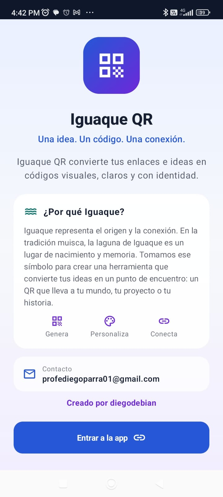
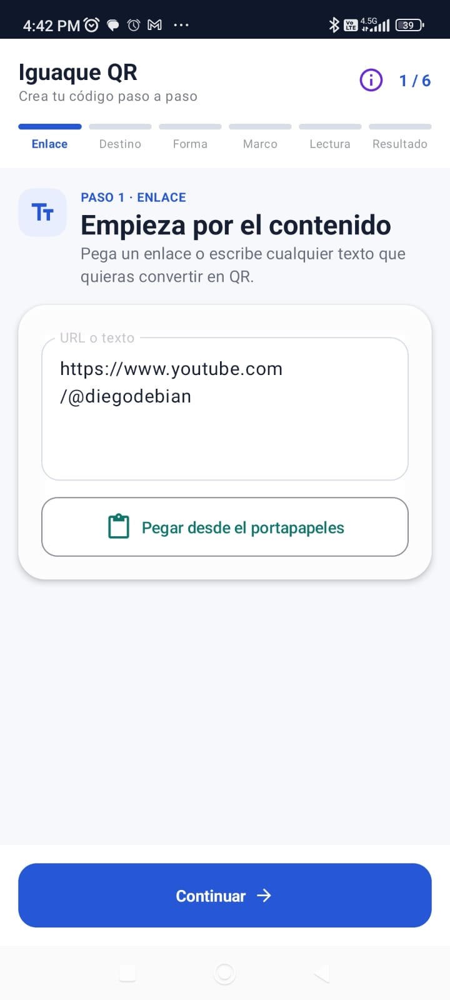
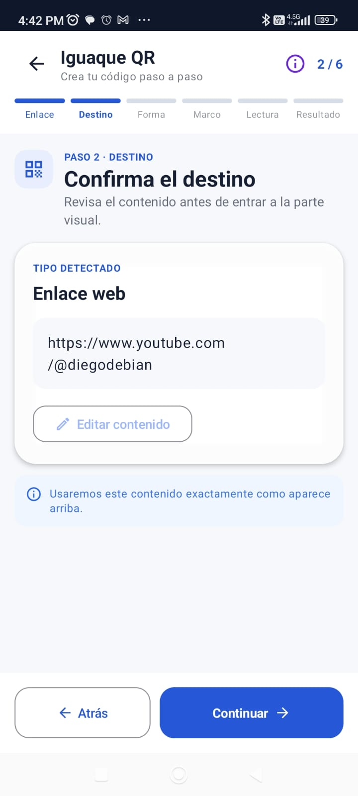
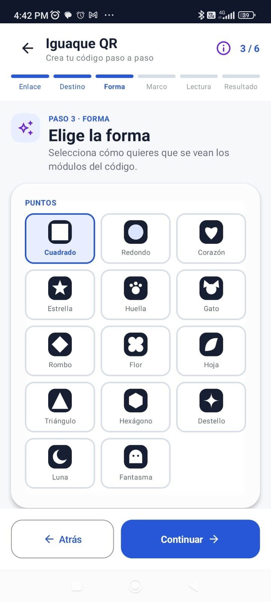
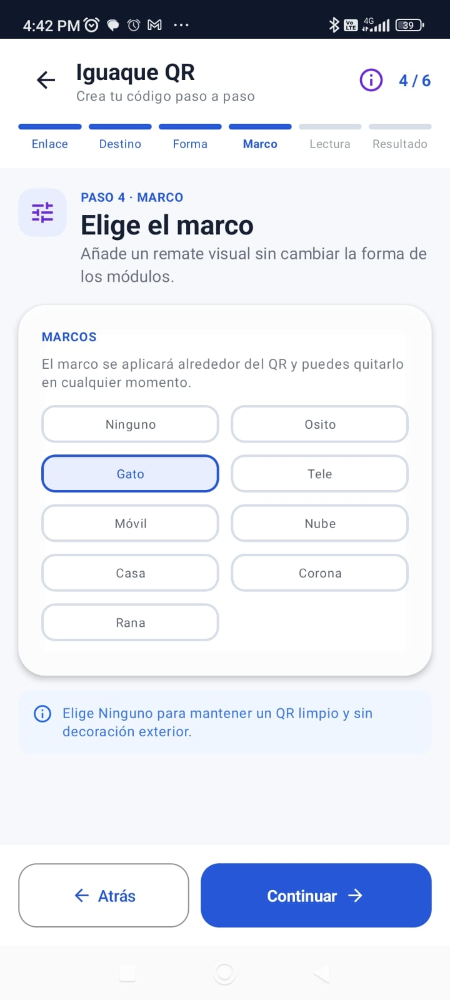
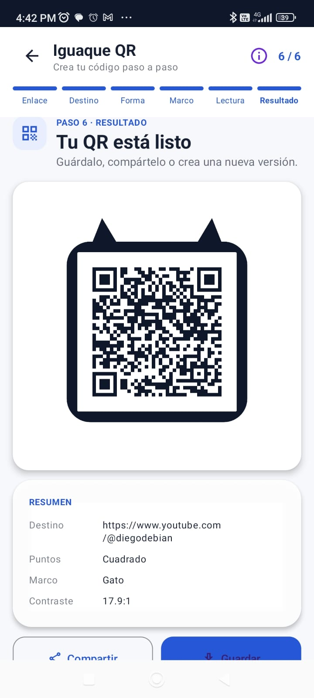

# Iguaque QR

<p align="center">
  
</p>

<h1 align="center">Iguaque QR</h1>

<p align="center"><em>Una idea. Un código. Una conexión.</em></p>

<p align="center">
  
  
  
  
  
  
  
</p>

## Iguaque QR

Convierte enlaces e ideas en códigos QR personalizados, claros y con identidad
mediante un flujo guiado, accesible y fácil de utilizar.

## ¿Por qué Iguaque?

Iguaque representa origen, conexión y memoria. El proyecto toma esta
inspiración para convertir una idea digital en un punto de encuentro.

## Características

- Flujo guiado de seis pasos.
- Texto y enlaces.
- Detección del tipo de contenido.
- Formas creativas y marcos visuales.
- Evaluación de contraste y legibilidad.
- Generación de alta resolución.
- Guardado, compartir e historial local.
- Funcionamiento sin servidor propio.

## Galería

<p align="center">
  
  
  
</p>
<p align="center">
  
  
  
</p>

| Vista | Descripción |
| --- | --- |
| Bienvenida y entrada | Inicio del flujo y captura del texto o enlace. |
| Confirmación y estilo | Revisión del destino y personalización visual. |
| Resultado QR | Código generado, listo para guardar o compartir. |

## Flujo de uso

```text
Contenido → Destino → Forma → Marco → Lectura → Resultado
```

“Lectura” se refiere a la comprobación de legibilidad y contraste del diseño,
no a la lectura mediante cámara.

## Arquitectura

- **Jetpack Compose:** interfaz declarativa y componentes visuales.
- **ViewModel:** estado y coordinación del flujo de creación.
- **ZXing Core:** generación de la matriz QR mediante `QRRenderer`.
- **Room:** persistencia local del historial.
- **MediaStore:** guardado de imágenes en el dispositivo.
- **FileProvider:** preparación segura de archivos para compartir.

## Tecnologías

| Tecnología | Función | Versión confirmada |
| --- | --- | --- |
| Android SDK | Compilación y plataforma objetivo | compileSdk/targetSdk 36; minSdk 26 |
| Kotlin | Lenguaje de la aplicación | 1.9.0 |
| Jetpack Compose | Interfaz declarativa | BOM 2023.08.00; compilador 1.5.5 |
| Room | Base de datos local | 2.5.2 |
| ZXing Core | Generación QR | 3.5.2 |
| Coil Compose | Carga de imágenes | 2.4.0 |

## Instalación y compilación

```bash
git clone https://github.com/Diego-debian/IguaqueQR.git
cd IguaqueQR
gradlew.bat assembleDebug
```

Se requiere Android SDK y un JDK compatible con la configuración del proyecto.
La configuración de firma de publicación no se incluye en el repositorio.

## Seguridad

- No se versionan llaves ni credenciales.
- No se incluyen rutas locales.
- El almacenamiento de datos es local.
- El proyecto no requiere backend propio.

## Documentación

- [Manual técnico](docs/evidencia/MANUAL_TECNICO.md)
- [Requerimientos](docs/evidencia/REQUERIMIENTOS.md)
- [Matriz de pruebas](docs/evidencia/MATRIZ_PRUEBAS.md)
- [Avisos de terceros](THIRD_PARTY_NOTICES.md)
- [Informe académico](docs/evidencia/INFORME_FINAL_GA8_AA1_EV02.md)
- [Resultados de pruebas AA2](docs/evidencia_aa2/RESULTADOS_PRUEBAS_AA2.md)
- [Incidencia Compose UI Test](docs/evidencia_aa2/INCIDENCIA_COMPOSE_UI_TEST.md)

## Resultados de la evidencia AA2

- 13 pruebas JVM aprobadas.
- 4 pruebas Room aprobadas.
- 5 pruebas QRRenderer aprobadas.
- 22 pruebas automatizadas ejecutadas y aprobadas.
- 5 pruebas Compose diseñadas y no ejecutadas por fallo del runner Xiaomi/MIUI.
- Corrección Unicode verificada mediante generación y decodificación con ZXing.

## Licencia

Iguaque QR se distribuye bajo la GNU General Public License versión 3 o
posterior (`GPL-3.0-or-later`).

SPDX-License-Identifier: GPL-3.0-or-later

Copyright © 2026 Diego Alberto Parra Garzón.

Puede consultar el texto completo en el archivo [LICENSE](LICENSE).

## Autor

**Diego Alberto Parra Garzón**  
GitHub: [@Diego-debian](https://github.com/Diego-debian)  
YouTube: [@diegodebian](https://www.youtube.com/@diegodebian)
